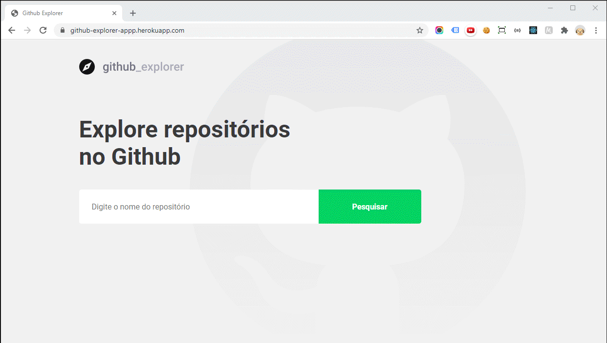

<h3 align=center>
<br>
Demo Preview: https://github-explorer-appp.herokuapp.com/
<br>
<br>
</h3>

## 📥 Executar esse projeto no seu computador

- Clonar Repositório: `git clone https://github.com/dxwebster/Primeiro-Projeto-com-ReactJS`
- Entrar na pasta? `cd Primeiro-Projeto-com-ReactJS`
- Instalar dependências: `yarn install`
- Rodar Aplicação: `yarn start`

## 🚩 Deploy no Heroku

Depois de clonar o repositório

- Logar no heroku `heroku login`
- Criar aplicação: `heroku create github-explorer-app`
- Adicionar o buildpack do React: mars/create-react-app
- Vincular o github à aplicação do Heroku e dar "Deploy Branch"

# Como criar esse projeto do zero

## 📚 Instalação e Configuração das Bibliotecas Front-End

**Instalar Template de Typescript do React:** `create-react-app primeiro-projeto-react --template=typescript`

**Instalar o React-Router-DOM:** `yarn add react-router-dom`

**Instalar os tipos do React-Router-DOM:** `yarn add @types/react-router-dom`

**Instalar o Styled-Components:** `yarn add styled-components`

**Instalar os tipos do Styled-Components:** `yarn add @types/styled-components`

**Instalar bilbioteca de cores:** `yarn add polished`

**Instalar React-Icons:** `yarn add react-icons`

**Instalar Axios**: `yarn add axios`

## Limpar estrutura do Template

Vamos fazer algumas alterações em arquivos do template que não vamos utilizar, ou que vamos recriar depois.

- Excluir Todos os arquivos .css
- Na pasta 'public' deixar apenas o index.html
- Excluir o Readme.md
- Excluir o App.test.tsx
- Excluir o logo.svg
- Excluir o serviceWorker.ts
- Excluir o setupTests.ts
- Abrir os arquivos 'index.tsx', App.tsx' e 'index.html' e remover as linhas que chamavam os arquivos que excluímos

## React-Scripts

O React-Scripts é um dependência que já vem instalada com o React-App e dentro dela já vem tudo configurado do Babel, Webpack (já tem importação de imagens e estilos também ). Não vamos precisar configurar isso na mão.

"scripts": {
"start": "react-scripts start",
"build": "react-scripts build",
"test": "react-scripts test",
"eject": "react-scripts eject"
},

## React-DOM

No arquivo index.html temos a div 'root' onde todo código React vai ser injetado dentro dessa div.

No src temos o arquivo index.tsx que utiliza o para renderizar nossa aplicação dentro de um elemento da DOM, no caso a div 'root'.

```tsx
import ReactDOM from 'react-dom';
document.getElementById('root');
```

## App

O App.tsx é o arquivo principal da aplicação.

No React, sempre escrevemos componentes no formato de função, ou seja, a variável que recebe o componente precisa ser com a tipagem `React.FC`.
A função é escrita assim normalmente:

```tsx
function App() {
  return <h1>Hello World!</h1>;
}
```

Mas setando sua tipagem como um "Function Component do React" (React.FC) ela ficará assim:

```tsx
const App: React.FC = () => <Routes />;
```

Lembrando que componentes, sempre escrevemos com letra maiúscula.

## Rotas

Tudo no react são componentes até as rotas.
No arquivo de rotas, vamos utilizar um component padrão do React chamado Route. Ele tem algumas propriedades (para visualizar basta clicar na tag do componente e pressionar ctrl + espaço).

A primeira propriedade que vamos utilizar é o path, que é o endereço que vamos acessar a primeira página, neste caso, o Dashboard. A outra propriedade será o componente que o usuário verá na tela quando ele acessar esse endereço.

```tsx
const Routes: React.FC = () => (
  <Switch>
    <Route path="/" component={Dashboard} />
  </Switch>
);
```

Utilizando o React-Router-DOM, temos alguns tipos de rotas. Nessa aplicação usaremos o `BrowserRouter`. Ele funciona como um endereço no browser, permite que eu digite a entidade na URL para acessar a rota correspondente.

Além disso, nossas rotas precisam ter o Switch que permite que apenas uma das rotas seja exibida, não as duas ao mesmo tempo.

## Estilos

Os arquivos .css no React, sempre acabam sendo globais e impactam toda a aplicação. Para resolver isso temos o Styled Components. Ele vai isolar o css para seu respectivo component, assim esse estilo não vai afetar no restante da aplicação (a menos que seja necessário). O estilo agora do componente será .ts e agora vamos criar componentes estilizados.

Aqui vamos criar um componente estilizado Title

```ts
import styled from 'styled-components';

export const Title = styled.h1`
  font-size: 48px;
  color: #3a3a3a;
`;
```

E vamos importar ele no dashboard e aplicar em volta do nosso título:

```tsx
import React from 'react';
import { Title } from './styles';

const Dashboard: React.FC = () => {
  return <Title> Explore repositórios no Github</Title>;
};

export default Dashboard;
```

## Estilo Global

Também precisamos setar alguns estilos que utilizaremos em toda a aplicação, chamamos de estilo global. Na pasta 'src' vamos criar uma pasta 'styles' e um arquivo 'global.ts'. Vamos importar do 'Styled-Components' o método 'createGlobalStyle'

```ts
import { createGlobalStyle } from "styled-components";
import githubBackground from "../assets/github.svg";

export default createGlobalStyle`
```

```css
*{
    margin: 0;
    padding: 0;
    outline: 0;
    box-sizing: border-box;
}
body{
    background: #F0F0F5 url(${githubBackground}) no-repeat 70% top;
    -webkit-font-smoothing: antialiased;
}

body , input , button {
    font: 16px Roboto, sans-serif;
}

#root {
    max-width: 960px;
    margin: 0 auto;
    padding: 40px 20px;
}

button{
    cursor: pointer;
}

`;
```

### CSS Tips

Quando eu tenho um elemento precedido do mesmo elemento (ex: listas com `<li>` ou `<a>`) e eu quiser colocar um espaçamento entre eles, faço da seguinte forma:

```css
   a + a {
      margin-top: 16px;
    }
    ``
```

Caso eu esteja usando o encadeamento de estilos, posso substituir o primeiro elemento pelo &:

```css
  a {
    background: #fff;
    border-radius: 5px;
    width: 100%;

    & + a {
      margin-top: 16px;
    }

```

## API Client

Na pasta src, criar a pasta services e o arquivo 'api.ts'.
Dentro da função create() do axios, vamos colocar a baseURL, que é o endereço que vai ser repetido em todas as requisições. Nessa aplicação vamos utilizar a api do Github: `https://api.github.com/`.

```ts
import axios from 'axios';

const api = axios.create({
  baseURL: 'https://api.github.com',
});

export default api;
```

Vamos importar a api em todas as páginas da nossa aplicação, nesse caso no Dashboard (página inicial) e Repository (página de listagem).

## Página: Dashboard

Agora criaremos as funções para busca de repositórios e adição deles na lista. A lógica será o seguinte:

- Acessar o valor que foi digitado dentro do input de busca
- Consumir a API do Github
- Salvar novo repositório

### Acessar o valor que foi digitado dentro do input de busca

Existem diversas formas de armazenar o valor do input, mas aqui usaremos o 'useState()'.O primeiro parâmetro é o novo repositório, o segundo parâmetro é uma função que usaremos quando quisermos alterá-lo, e dentro do 'useState()' é o estado inicial, ou seja, vazio pois não temos nenhum novo repositório.

```tsx
const [newRepo, setNewRepo] = useState('');
```

Agora no 'input', colocaremos o 'value' como 'newRepo', e o 'onChange' faremos um evento (e) que vai armazenar o valor do input. Vamos passar como parâmetro para a função 'setNewRepo()';

```tsx
<input
  value={newRepo}
  onChange={(e) => setNewRepo(e.target.value)}
  type="text"
  placeholder="Digite o nome do repositório"
/>
```

No form, colocaremos um submit para acionar a função de adição de repositório quando o formulário for enviado.

```tsx
<Form onSubmit={handleAddRepository}>
```

A função que lida com a adição do novo repositório é a 'handleAddRepository()'. Como estamos chamando ela por meio de um submit do form, precisamos informar que não precisaremos ser redirecionados para outra página (esse redirect é um evento padrão do html). Fazemos isso por meio do'FormEvent' do React, e colocando o evento como parâmtro da função. Dentro da função executaremos o 'preventDefault()' que impede o redirecionamento da página. Ele precisa ficar no começo da função.

```tsx
function handleAddRepository(event: FormEvent<HTMLFormElement>): void {
  event.preventDefault();
}
```

## Consumir a API do Github

Dentro da função handleAddRepository(), teremos nossa api de busca de repositórios. Esse request irá retornar um objeto, pois queremos algumas informações do Repositório buscado (nome, descrição, etc).

```tsx
const response = await api.get<Repository>(`repos/${newRepo}`);
```

Como esse resultado é um objeto, ou seja, não é do tipo padrão (string, boolean, number), precisamos informar qual o tipo de cada dado por meio de uma interface.

```tsx
interface Repository {
  full_name: string;
  description: string;
  owner: {
    login: string;
    avatar_url: string;
  };
}
```

## Salvar novo repositório

Para salvar incluir o novo repositório buscado na lista de reposiórios, vamos armazenar ele num estado. Nesse caso, o primeiro parâmetro é a lista de repositórios, o segundo é a função que executaremos para alterá-lo e dentro do 'useState()' é o estado inicial da lista de repositórios, ou seja, vazia.

```tsx
const [repositories, setRepositories] = useState([]);
```

A chamada a api, ficará dentro da função 'handleAddRepository'. O resultado vamos armazenar dentro de uma variável 'repository' e depois incluir ela no 'setRepositories()' com um spread operator. No final chamamos a função setNewRepo() vazia para limpar o input de busca.

```tsx
async function handleAddRepository(
  event: FormEvent<HTMLFormElement>
): Promise<void> {
  event.preventDefault();

  const response = await api.get<Repository>(`repos/${newRepo}`);

  const repository = response.data;

  setRepositories([...repositories, repository]);

  setNewRepo('');
}
```

## Lidando com Erros

Precisamos agora incluir a lógica que vai tratar das seguintes ações de usuário:

- Enviar o form com o input vazio
- Buscar um repositório que não existe.

Vamos criar um estado:

```tsx
const [inputError, setInputError] = useState('');
```

Para verificar se o input está vazio, vamos fazer um "if input vazio, retorna a mensagem de erro"

```tsx
if (!newRepo) {
  setInputError('Digite o autor/nome do repositório');
}
```

Para responder caso o usuário digitar um nome de repositório que não existe, vamos colocar todo o resto (chamada a api e inclusão do novo repositorio) dentro de um try e depois, limpar a mensagem de erro se der tudo certo e com o catch exibir a mensagemm de erro:

```tsx
try {
  const response = await api.get<Repository>(`repos/${newRepo}`);

  const repository = response.data;

  setRepositories([...repositories, repository]);

  setNewRepo('');

  setInputError('');
} catch (err) {
  setInputError('Erro na busca por esse repositório');
}
```

Vamos exibir essa mensagem de erro em um novo componente logo abaixo do formulário com um "if o inputError" está preenchida, aparece o error. Nesse formato de if o que vem depois do && só vai ser executado, se o que vem antes for satisfeito.

```tsx
{
  inputError && <Error>{inputError}</Error>;
}
```

## Estilização do Form quando der erro

No nosso component estilizado `<Form />`, vamos incluir um parâmetro que vai estilizar o input caso de um erro por meio do hasError que retorna um booleano (true ou false).

```tsx
<Form hasError={!!inputError} onSubmit={handleAddRepository}>
```

Agora nos estilos, preciso informar que o component Form vai receber esse parâmetro hasError, por meio de uma interface.

```ts
interface FormProps {
  hasError: boolean;
}
```

Lá no estilo do 'Form', incluimos a tipagem 'FormProps', e dentro do 'input' usamos uma função que nos traz os parâmetros para que possamos incluir o css.

```ts
export const Form = styled.form<FormProps>`
  margin-top: 40px;
  max-width: 700px;
  display: flex;

  input {

    [...]

    ${(props) =>
      props.hasError &&
      css`
        border-color: #c53030;
      `}

  }
```

## Salvando no Local Storage

Sempre que eu tiver uma mudança na variável 'repositories' eu vou salvar no Local Storage. Para fazer isso vamos utilizar o useEffect, que permite que disparemos uma função (primeiro parâmtro) sempre que uma variável mudar (segundo parâmetro).

```tsx
useEffect(() => {
  localStorage.setItem(
    '@GithubExplorer:repositories',
    JSON.stringify(repositories)
  );
}, [repositories]);
```

Agora no meu 'useState' de repositorios, vamos incluir na listagem o que estiver salvo no local storage. dentro do 'useState' vamos incluir uma função que vai verificar no localStorage se existir alguma informação lá, retorna essa informação e inclui no estado inicial, se não existir, retorna um objeto vazio.

```tsx
const [repositories, setRepositories] = useState<Repository[]>(() => {
  const storageRepositories = localStorage.getItem(
    '@GithubExplorer:repositories'
  );
  if (storageRepositories) {
    return JSON.parse(storageRepositories);
  } else {
    return [];
  }
});
```

## Navegando entre rotas

Vamos importar o Link do React-Router-DOM, e substituir nossos <a> pelo Link. Para a rota vamos incluir de qual repositório esse link se refere

```tsx
import { Link } from 'react-router-dom';

[...] // restante do código

<Link
  key={repository.full_name}
  to={`/repositories/${repository.full_name}`}
>
```

No nosso arquivo de rotas, vamos atualizar a rota de Repository para que ele reconheça a url correta do repositório selecionado. Com o sinal de +, tudo que vier depois da barra é o nome do repositório.

```tsx
<Route path="/repository/:repository+" component={Repository} />
```

## Página: Repository

Vamos importar do 'React-Router-DOM' o 'useRouteMatch' que nos permite acessar os parâmetros da rota.

```tsx
import React from 'react';
import { useRouteMatch } from 'react-router-dom';

interface RepositoryParams {
  repository: string;
}

const Repository: React.FC = () => {
  const { params } = useRouteMatch<RepositoryParams>();

  return <h1>Repository: {params.repository}</h1>;
};

export default Repository;
```
